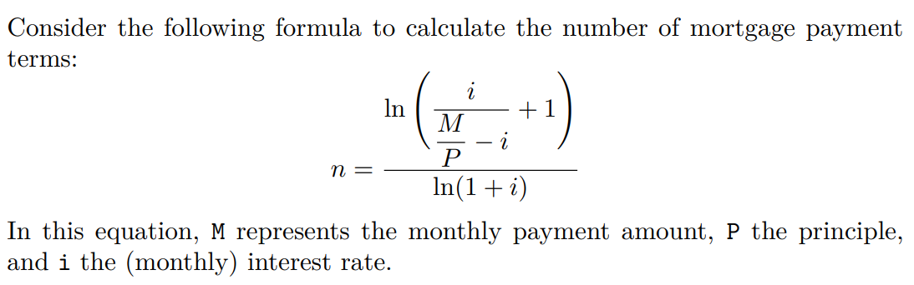

# Calculate the following:

- 543 + 87655
- (3215 + 23) / 42
- 3 ^ 5
- 45 %% 7
- body_mass_index <- weight_in_kgs/(height_in_meters ^ 2) when weight is 75 kilograms and height is 1.70 meters

***

# Find u
*given*,

```{r}
#| echo: TRUE
#| eval: FALSE
p <- 145
q <- 212
r <- 56
```

and 

```{r}
#| echo: TRUE
#| eval: FALSE
u <- c(p, q, r)
```

Also calculate

```{r}
#| echo: TRUE
#| eval: FALSE
u <- c(u, u, u, u)

sum(u)

mean(u)

min(u)

max(u)

sd(u)
```


***


# find class and typeof for the following variables:


```{r}
#| echo: TRUE
#| eval: FALSE
numeric_var <- 78

character_var <- "Bloomberg Research Center"

logical_var <- TRUE 

evenNumbers <- c(2, 4, 6, 8, 10, 12, 14, 16, 20)

zero <- 0

pi <- 3.141593

powersOfTen <- c(1, 10, 100, 1000, 10000, 100000)
```

***


# vectors

Consider the following vectors:

```{r}
#| echo: TRUE
#| eval: FALSE
a <- 17
b <- 6
```

Use the elementary arithmetic operators +, -, *, /, and ˆ to:

- a) add a and b
- b) subtract b from a
- c) multiply a by b
- d) divide a by b
- e) raise a to the power of b

*** 


Consider the following vectors:


```{r}
#| echo: TRUE
#| eval: FALSE
a <- c(1, 3, 5, 7, 9)
b <- c(2, 4, 6, 8, 10)
```

Find the following:

- a) add a and b
- b) subtract b from a
- c) multiply a by b
- d) divide a by b
- e) raise a to the power of b
- f) (13 * a + b) / 10
- g) (a + 0.15 * b) ˆ 2
- h) (a + 21) * (a - 9) + b


***

# Mortgage payment



- Calculate the number of payment terms *n* for a mortgage with a principle balance *P* of $380,000, monthly interest rate *i* of 0.045%, and monthly payment amount *M* of 1850.

- What if all else is the same (no change in other variables) but monthly payments *M* is now given as a vector 

```{r}
#| echo: TRUE
#| eval: FALSE
c(1100, 1200, 1300, 1400, 1500, 1600, 1700, 1800, 1900, 2000)
```
?

***
